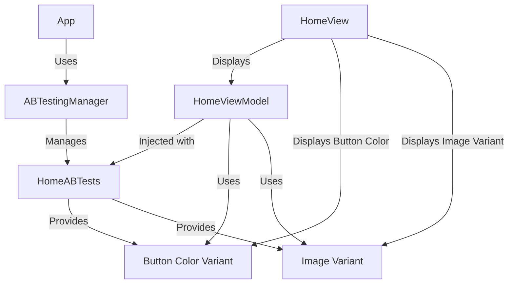

# A/B Testing Architecture for iOS App

## Simplified Architecture Diagram

Here’s a simplified diagram that shows the flow of data and interactions between components:

---

## Overview

This document outlines the architecture for implementing scalable and maintainable A/B testing in an iOS app. The proposed architecture ensures flexibility, modularity, and easy extensibility as your app grows.

The main goals of this approach are:

- **Centralized Test Management**: Keep the logic for fetching test variants isolated from UI components.
- **Reusability**: Ensure A/B test variants are easily accessible across multiple views/screens without redundant code.
- **Extensibility**: Make it easy to add new tests without affecting existing functionality.
- **Minimal Coupling**: Decouple A/B test logic from views by using dependency injection.

## Architecture Concept

### 1. **ABTestingManager** - Centralized Manager
The **ABTestingManager** acts as the central hub that manages all A/B tests in the app. It provides access to different test groups, which in turn contain the specific A/B test variants.

#### Key Responsibilities:
- Manages test groups (e.g., Home, Product).
- Provides access to the test variants (e.g., button color, image).

### 2. **HomeABTests** - Test Group for Home Screen
Each screen or feature of the app has a corresponding test group, such as `HomeABTests` for the Home screen. This group contains the variants specific to that feature, such as **Button Color** and **Image**.

#### Key Responsibilities:
- Defines A/B test variants (e.g., button color, image).
- Provides these variants to the ViewModel.

### 3. **HomeViewModel** - ViewModel for Home View
The **HomeViewModel** serves as an intermediary between the **HomeABTests** and the **HomeView**. It is responsible for injecting the appropriate test data (variants) into the view for rendering.

#### Key Responsibilities:
- Receives the A/B test group (`HomeABTests`).
- Exposes the test variants to the View (e.g., **Button Color**, **Image**).

### 4. **HomeView** - The View
The **HomeView** is where the UI is displayed. It uses the variants provided by the **HomeViewModel** to adjust the UI dynamically (e.g., button color, image variant).

#### Key Responsibilities:
- Displays UI elements based on the variants provided by the **HomeViewModel**.

---

## Data Flow

### 1. **Test Group Management**:
- The **App** accesses the **ABTestingManager** to manage all the test groups.
- **ABTestingManager** contains and provides access to test groups like **HomeABTests**.

### 2. **Test Group and ViewModel**:
- The **HomeABTests** test group provides test variants (e.g., button color and image) to the **HomeViewModel**.

### 3. **ViewModel to View**:
- The **HomeViewModel** exposes the variants to the **HomeView**, which adjusts the UI based on the provided data.

### 4. **UI Display**:
- The **HomeView** dynamically updates the UI elements (e.g., button color, image) based on the variants provided by the **HomeViewModel**.

